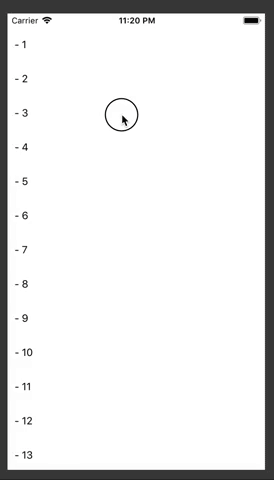

# SwipeableView

SwipeView to recreate the UITableViewRowAction. You can customize every action with backgroundColor and UIImage easily. 



## Example

Create SwipeableView and add an action:

```swift
let cell = SwipeableView(frame: CGRect(x: 0, y: 0, width: self.frame.size.width, height: 50), backgroundColor: .white)

cell.addAction(title: "Dog",
image: UIImage(named: "dog") ?? UIImage(),
backgroundcolor: UIColor.red) {
self.showAlert("Dog \(num)")
}
```

For futher instructions see the project demo.

NOTE: SwipeView works on UITableViewCell as subview and also on UIScrollView. To use it on UITableView Header and Footer use it as subview of Header or Footer, do not pass it directly because it will be resized automatically and the swipe will broke. 
